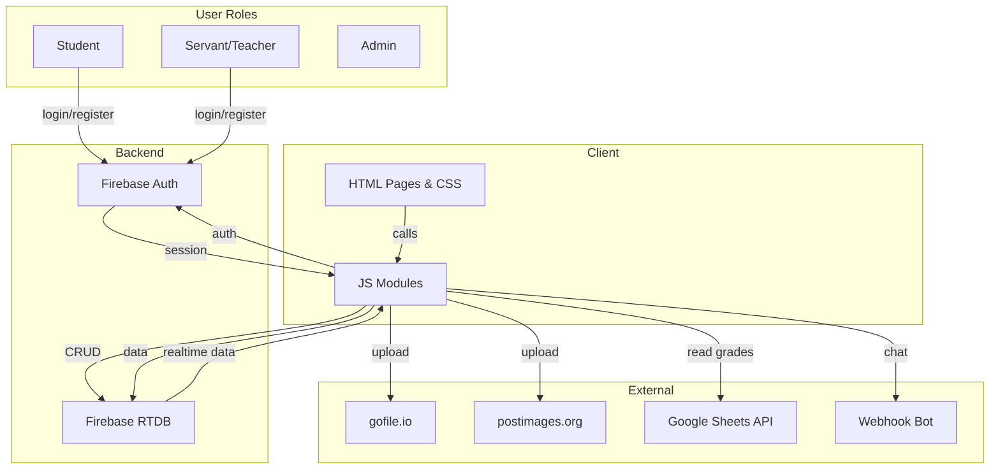
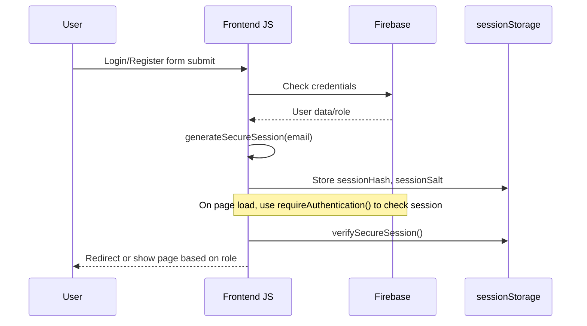
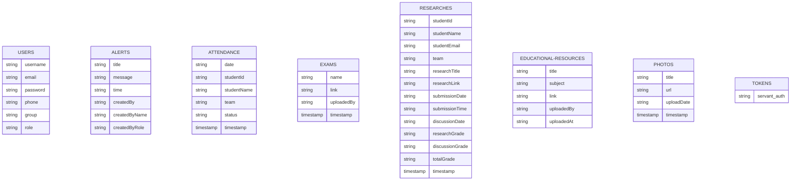
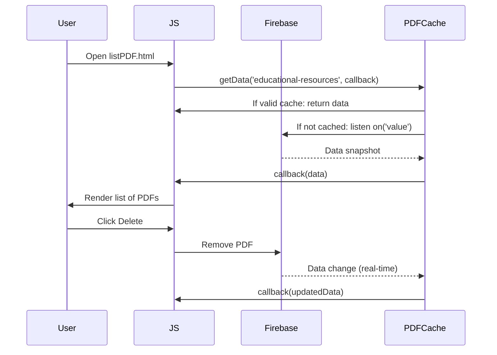

# 📚 Khedmty Church Service Management System Documentation

Welcome to the technical documentation for the Khedmty system — a comprehensive web app for managing church service activities at كنيسة السيدة العذراء مريم - عزبة النخل. This guide covers all key files, features, data flows, main modules, and API/data access patterns present in your codebase.

---

## 📖 Index

1. [System Overview](#system-overview)
2. [Architecture & Data Flows](#architecture--data-flows)
3. [Key Modules & Files](#key-modules--files)
   - [Authentication & Session Management](#authentication--session-management)
   - [Navigation & Layout](#navigation--layout)
   - [Student Dashboard](#student-dashboard)
   - [Teacher Dashboard](#teacher-dashboard)
   - [Attendance Management](#attendance-management)
   - [Alerts & Notifications](#alerts--notifications)
   - [Exams Management](#exams-management)
   - [Research (أبحاث) Management](#research-أبحاث-management)
   - [PDF & Photo Resources](#pdf--photo-resources)
   - [Grades & Ranking](#grades--ranking)
   - [Profile & Registration](#profile--registration)
   - [Chatbot Assistant](#chatbot-assistant)
   - [Utility CSS](#utility-css)
   - [Sitemap](#sitemap)
4. [Firebase Data Schema](#firebase-data-schema)
5. [API Endpoints](#api-endpoints)
6. [Mermaid Diagrams](#mermaid-diagrams)
7. [Security Notes](#security-notes)
8. [Best Practices & UX](#best-practices--ux)
9. [Appendix: File Reference Table](#appendix-file-reference-table)

---

## System Overview

**Khedmty** is a full-featured system for student/servant management, attendance tracking, exam handling, resource sharing (PDFs/photos), and digital research submission/evaluation for a Coptic Orthodox church.

- **Frontend:** HTML, CSS, JS
- **Backend:** Firebase Realtime Database (NoSQL) for data, authentication, and storage
- **Security:** Secure session management using hashed session storage
- **Special features:** 
  - Mobile-first responsive UI
  - Role-based access (student vs servant/teacher/admin)
  - File/resource uploads via third-party (e.g., gofile.io, postimages.org)
  - Realtime updates with smart cache/listener management

---

## Architecture & Data Flows



---

## Key Modules & Files

### Authentication & Session Management

- **sessionUtils.js**
  - Handles secure session creation (`generateSecureSession(email)`), verification (`verifySecureSession()`), and clearing (`clearSession()`).
  - Sessions are stored in `sessionStorage` as a hash and random salt (Base64-encoded).
  - **Roles**: `student`, `servant`, etc., are checked on access to restrict sensitive pages.

**Mermaid - Session Flow:**


---

### Navigation & Layout

- **style.css, botStyle.css, profileStyle.css, ...**
  - Unified color schemes, cross-background animation, responsive navigation bar, hamburger menu for mobile, etc.
  - All pages have a `navbar`, footer, and consistent main content area.
- **Cross-background effect**: SVG crosses float in the background for a church-themed look.

---

### Student Dashboard

- **studentDashboard.html**
  - Centralized student entry point: shows latest alerts, progress bar (attendance), quick links, and cards for all major features.
  - Loads data via Firebase and displays dynamic progress.

**Main Features:**
- Latest notifications
- Attendance-based progress bar
- Quick links to:
    - Alerts, PDFs, Photos, Exams, Research, Grades, Profile, Ranking, Home

**Data Flow:**
- Uses a `DataCache` class for 5-minute smart caching + real-time listeners for: `alerts`, `attendance`, `researches`, etc.
- Progress is calculated based on attendance records and research submission status for the logged-in student.

---

### Teacher Dashboard

- **teacherDashboard.html**
  - Servant/teacher main dashboard with stats cards (students, alerts, attendance rate, resources, exams, research).
  - Real-time cache/listeners for all data.
  - Quick navigation to all admin tools (attendance, alerts, PDFs/photos, exams, research, grades, ranking).
  - 💬 Includes a chatbot assistant for frequently asked questions.

**Stats Cards:**
- إجمالي الطلاب (Total students)
- التنبيهات النشطة (Active alerts)
- معدل الحضور (Attendance rate)
- المصادر التعليمية (PDFs)
- الامتحانات المتاحة (Exams)
- البحوث المسلمة (Research submitted)

---

### Attendance Management

- **AttendanceData.html, AttendanceRegistration.html, styleAttendance*, attendance.js**
  - **AttendanceData.html**: For servants to take attendance for a date. Lists all students, by group, allows marking as present/absent, filtering, export to Excel.
  - **AttendanceRegistration.html**: Historical attendance record viewing, export, print, date selection.
  - **attendance.js**: Handles authentication, data fetching, attendance marking, exporting (with right-to-left support), and filtering.

**Mermaid - Attendance Data Saving:**
```mermaid
flowchart LR
    Start([Servant logs in])
    LoadStudents --> MarkAttendance
    MarkAttendance --> SaveAttendance
    SaveAttendance -->|writes| FirebaseAttendance[(Firebase: attendance/<date>/<studentId>)]
    FirebaseAttendance --> Success[Show "Saved" message]
```

---

### Alerts & Notifications

- **alerts-list.html, create-alert.html**
  - **alerts-list.html**: Lists all alerts in reverse chronological order, showing title, message, time, and creator.
  - **create-alert.html**: Servants can create and delete alerts (with role-checking).
  - Alerts are stored under `alerts` in Firebase, and every alert contains `title`, `message`, `time`, `createdBy`, etc.

---

### Exams Management

- **exam-list.html, student-exam.html**
  - **exam-list.html**: Servants can view, open, and delete exams (Google Forms, etc.) via stored links.
  - **student-exam.html**: Students view available exams and open them. Role verification ensures only students access this page.
  - **upload-exam.html**: Servants can add new exams (name + link).

---

### Research (أبحاث) Management

- **Research.html, uploadResearch.html**
  - **Research.html**: (Servant) Table of all research submissions: student info, PDF link, submission/discussion grades, editable discussion date/grades.
  - **uploadResearch.html**: (Student) Form for submitting research (title, link). Shows scheduled discussion date if available.

---

### PDF & Photo Resources

- **uploadPDF.html, listPDF.html, listPDF-Stu.html**
  - **uploadPDF.html**: Servant uploads educational PDF: title, subject, link (uploaded externally via gofile.io).
  - **listPDF.html**: Resource list with filtering (by subject), viewing, sharing, and deleting (servant only).
  - **listPDF-Stu.html**: Student view (no delete).
- **uploadPhotos.html, listPhotos.html, listPhotos-stu.html**
  - **uploadPhotos.html**: Servant uploads image by title and external link (postimages.org).
  - **listPhotos.html**: Photo gallery with filtering, viewing, sharing, and deleting (servant only).
  - **listPhotos-stu.html**: Student view (no delete, has image modal).

**Cache Classes**: All PDF/Photo listing/upload scripts use smart cache management classes to minimize Firebase traffic and auto-update UI.

---

### Grades & Ranking

- **Grades.html**: Student sees their grades (from Google Sheets, plus research grades from Firebase).
- **totalGrades.html**: Servant sees all grades, with search, filtering, and live statistics.
- **studentRank.html**: Shows top 10 students by attendance ratio (with nice progress bars and badges).
- **Ranking Algorithm**: Only attendance is used for ranking (not research).

---

### Profile & Registration

- **profilepage.html, editprofile.html, register.html, login.html**
  - **profilepage.html**: Student/servant profile with info and links to edit/logout.
  - **editprofile.html**: Edit personal info (except email).
  - **register.html**: Registration form (role select). Servants must enter a secret token (loaded from Firebase).
  - **login.html**: Login with email/password.

---

### Chatbot Assistant

- **botScript.js, botStyle.css**
  - Chatbot runs on teacherDashboard only.
  - Sends user questions to a webhook (n8n/Node.js endpoint), which returns a response to display in the chat.

---

### Utility CSS

- **style.css**: Core layout, navbar, responsive design for most pages
- **botStyle.css**: Styles for chatbot widget
- **profileStyle.css, registeration.css, styleAttendance.css, styleAttendanceData.css, listPDF.css, listPhotos.css, exam-list.css, student-exam.css, upload-exam.css, uploadPDF.css**
- All CSS files focus on accessibility, mobile-friendliness, right-to-left support, and attractive church-themed visuals.

---

### Sitemap

- **sitemap.xml**: SEO sitemap with direct links to major pages

---

## Firebase Data Schema



---

## API Endpoints

Most access is via Firebase Realtime Database. For completeness, here is a sample of how PDF resources are managed:

```api
{
  "title": "List Educational PDFs",
  "description": "Get all uploaded educational PDFs with real-time updates and caching",
  "method": "GET",
  "baseUrl": "https://edad-5odam-default-rtdb.europe-west1.firebasedatabase.app",
  "endpoint": "/educational-resources.json",
  "headers": [],
  "queryParams": [],
  "pathParams": [],
  "bodyType": "none",
  "requestBody": "",
  "responses": {
    "200": {
      "description": "List of PDFs",
      "body": "{\n  \"pdfKey1\": {\n    \"title\": \"Lesson 1\",\n    \"subject\": \"Theology\",\n    \"link\": \"https://gofile.io/d/abc123\",\n    \"uploadedBy\": \"servant@email.com\",\n    \"uploadedAt\": \"2024-05-01T12:00:00Z\"\n  }, ...}"
    }
  }
}
```

**Other endpoints (patterns):**
- `/alerts.json`
- `/attendance/<date>.json`
- `/users/<emailKey>.json`
- `/researches.json`
- `/exams.json`
- `/photos.json`
- `/tokens/servant_auth.json`

**Bot Webhook (n8n):**

```api
{
  "title": "Ask Chatbot",
  "description": "Send a question to the assistant bot and get a reply",
  "method": "POST",
  "baseUrl": "https://mina8maher.app.n8n.cloud",
  "endpoint": "/webhook-test/318b59bf-9f07-436b-8fee-26a705fcd93e",
  "headers": [
    {"key": "Content-Type", "value": "application/json", "required": true}
  ],
  "queryParams": [],
  "pathParams": [],
  "bodyType": "json",
  "requestBody": "{ \"message\": \"ما هي مواعيد الحضور؟\" }",
  "responses": {
    "200": {
      "description": "Bot reply",
      "body": "{ \"reply\": \"الحضور يوم الجمعة الساعة 6 مساءً...\" }"
    },
    "500": {
      "description": "Error",
      "body": "{ \"error\": \"...\" }"
    }
  }
}
```

---

## Mermaid Diagrams

### Example: PDF Smart Cache System



---

## Security Notes

- **Session security**: Sessions are not just email-in-sessionStorage, but a hash and random salt (crypto/atob/btoa).
- **Role enforcement**: All sensitive actions (creating/deleting alerts, uploading PDFs/photos/exams) require servant/admin role, checked on every page.
- **Input validation**: All forms validate required fields, URLs, and for servants, verify the secret token.

---

## Best Practices & UX

- **Mobile-first design**: All pages have fully adaptive layouts.
- **RTL support**: All text is right-to-left for Arabic.
- **Accessibility**: Focus indicators, ARIA attributes for menus, alt text for images.
- **User feedback**: Success/error/info messages, loading spinners, progress bars.
- **Smart caching**: 5-minute cache on all major lists with real-time auto-update.
- **Resource uploads**: Users upload files externally (no direct PDF/image upload to Firebase storage for simplicity).

---

## Appendix: File Reference Table

| File                        | Purpose/Module                                    |
|-----------------------------|---------------------------------------------------|
| `index.html, index.js`      | Landing page, session-aware navigation            |
| `studentDashboard.html`     | Student dashboard, progress, quick links          |
| `teacherDashboard.html`     | Servant dashboard, stats, navigation              |
| `AttendanceData.html`       | Attendance marking (servant only)                 |
| `AttendanceRegistration.html`| Attendance records/history (servant only)         |
| `attendance.js`             | JS for attendance UI/data logic                   |
| `alerts-list.html`          | List all alerts                                   |
| `create-alert.html`         | Create/delete alerts (servant only)               |
| `exam-list.html`            | Exam list (servant only)                          |
| `exam-list.js`              | JS for exam CRUD                                  |
| `student-exam.html`         | List of available exams for students              |
| `student-exam.js`           | JS: Fetch/exam start for students                 |
| `upload-exam.html`          | Exam upload form (servant only)                   |
| `upload-exam.js`            | JS for exam upload/auth                           |
| `Grades.html`               | Student: view grades from Google Sheets & research|
| `totalGrades.html`          | Servant: view all grades, stats, search           |
| `Research.html`             | Servant: manage research submissions              |
| `uploadResearch.html`       | Student: submit research, see discussion date     |
| `listPDF.html`              | Servant: manage/view PDFs                         |
| `listPDF-Stu.html`          | Student: view PDFs (no delete)                    |
| `listPDF.js`                | JS: PDF list, smart cache, filtering              |
| `uploadPDF.html`            | Servant: upload PDF resources                     |
| `uploadPDF.js`              | JS: PDF upload, smart cache                       |
| `listPhotos.html`           | Servant: manage photos                            |
| `listPhotos-stu.html`       | Student: view photos (modal)                      |
| `listPhotos.js`             | JS: Photo list, smart cache, filtering            |
| `uploadPhotos.html`         | Servant: upload photo resources                   |
| `uploadPhotos.js`           | JS: Photo upload, smart cache                     |
| `profilepage.html`          | Profile view                                      |
| `editprofile.html, editprofile.js` | Edit profile info                        |
| `register.html, register.js`| Registration form, servant token auth             |
| `login.html, login.js`      | Login form/authentication                         |
| `sessionUtils.js`           | Secure session management                         |
| `botScript.js, botStyle.css`| Chatbot widget (servant only)                     |
| `sitemap.xml`               | SEO sitemap                                       |
| `style.css`, `profileStyle.css`, etc.| Main UI styling                      |

---

## 🎉 Congratulations!

You now have a detailed technical reference for your Khedmty church management system. This covers every major feature, data flow, security check, and user experience element in the codebase. For further expansion, consider modularizing JS code, implementing direct file uploads (Firebase Storage), or enhancing the chatbot with NLP.

---

**For any code-specific questions, file-specific UX, or further Mermaid diagrams, just ask!**